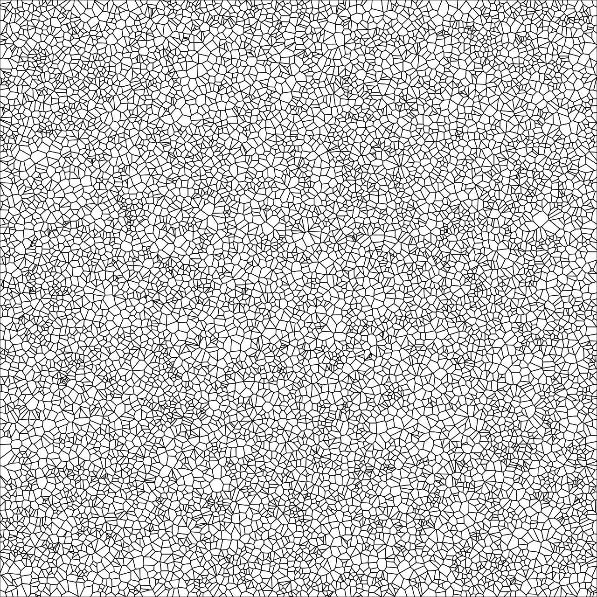

# Computer Graphics - CSE306
## Ray Tracer
Implementing Ray Tracer in C++


## Compiling the code
```
g++ -std=c++11 -Xpreprocessor -fopenmp -I/usr/local/include -L/usr/local/lib -lomp  main.cpp -o main
```

## Geometry Processing
Implementing algorithms to generate Voronoï/power diagrams.

<p align="center">
    
    
    
</p>